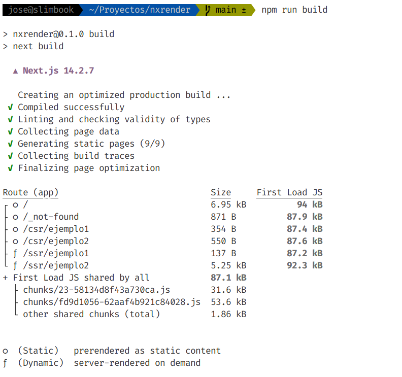

# Proyecto NextJS. Contenido estático/dinámico. CSR/SSR. 


## Contenido estático vs Contenido dinámico

La definición de contenido estático y dinámico es muy sencilla:

- **Contenido estático** es aquel que **NO cambia** a lo largo del tiempo.
- **Contenido dinámico** es aquel que **SÍ cambia** a lo largo del tiempo.

> **MUY IMPORTANTE:**
>
> **Cuando hablamos de contenido, nos referiremos al código fuente de la página**, no a lo que ve el usuario.
>
> Por ejemplo, podemos tener una página con código javascript que se ejecuta en el navegador. Dicho código se encarga de generar un número aleatorio, por lo cual el usuario verá un número distinto cada vez que refresque la página. Sin embargo el código javascript no cambia nunca. Decimos por tanto que el contenido es estático. 
>
> Lo dicho anteriormente puede resultar contraintuitivo pero, debido a razones históricas, ésta es la terminología empleada. En los inicios, los servidores web sólo eran capaces de servir contenido estático: HTML, CSS, Javascript, imágenes, ... No se entraba a valorar si el código javascript enviado al navegador modificaba o no dicha información. **Desde el punto de vista del lado servidor, el contenido enviado al navegador es estático**. Hoy en día, con el uso de AJAX y `fetch` en el navegador resulta aún más contraintuitivo decir que el contenido es estático, pero  así es considerado por muchos desarrolladores y por NextJS, como veremos más adelante con un ejemplo práctico.
>
> **El término de contenido dinámico se reserva en exclusiva para cuando dicho contenido es generado desde el lado servidor**. Uno de los primeros procedimientos que se usó para generar contenido dinámico fue [CGI](https://es.wikipedia.org/wiki/Interfaz_de_entrada_com%C3%BAn). Luego vendrían gran cantidad de lenguajes interpretados en el servidor, siendo PHP uno de los más populares. La generación de contenido dinámico requiere de un servidor web más complejo, que sea capaz de ejecutar código y de manejar los problemas de seguridad que ello pudiera acarrear.


## Renderizado en el Servidor vs Renderizado en el Cliente

El renderizado es la **representación gráfica del contenido de una página**, es decir, el proceso necesario para mostrar una página web en un navegador.

Existen 2 tipos de renderizado:

1. Client-Side Rendering (CSR) 
2. Server-Side Rendering (SSR)

NextJS soporta ambos tipos de renderizado, aunque recomienda usar SSR siempre que se pueda. Podemos entender SSR como sinónimo de generación en el lado servidor de contenido dinámico.

Para realizar ***build*** ejecutamos: 

```sh
npm  run  build
```



Para lanzar: 

```sh
npm  run  start
```
# Rick-Morty-Api
